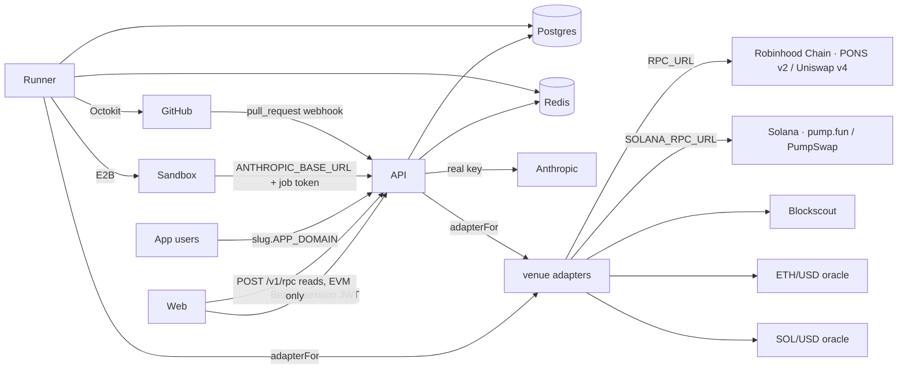
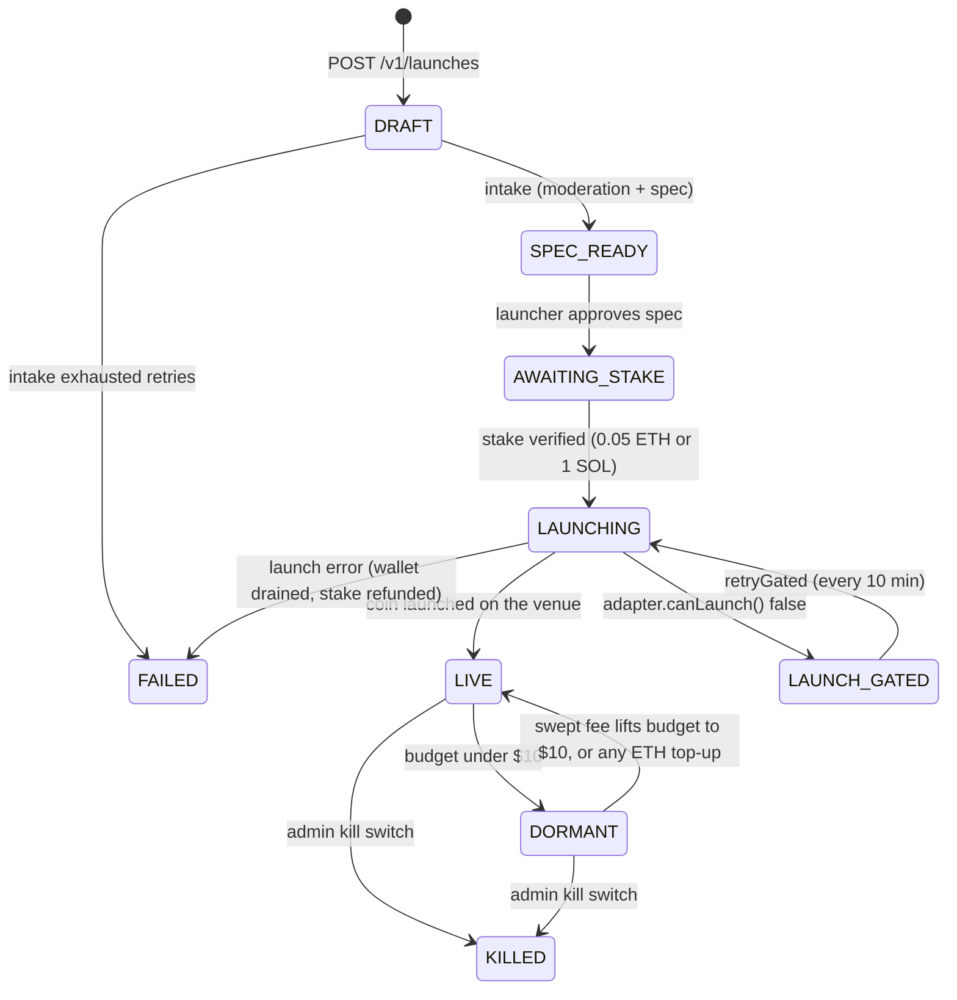
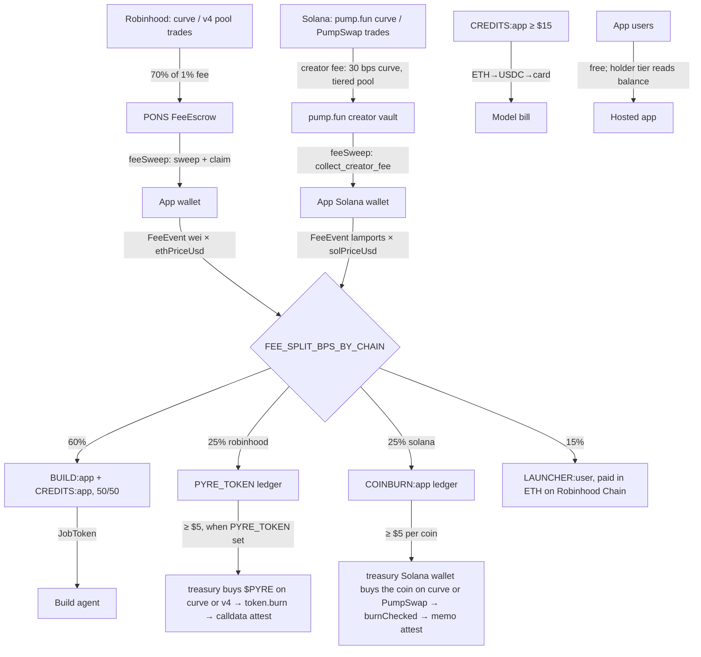

# Pyre architecture

Pyre is a launchpad where every coin funds one app. A coin launches on one of two **venues** — PONS v2 on Robinhood Chain (chain id 4663) or pump.fun on Solana — behind one adapter interface. Creator fees from the coin accrue into a build budget; an AI agent spends that budget building and shipping the app; 25% of every coin's fees is bought back and burned: $PYRE on Robinhood Chain, the coin's own supply on Solana. $PYRE itself is one coin on Robinhood Chain and nowhere else. The app is free to use. Three deployable services, one Postgres, one Redis.

## Services

| Service | Package | Role |
| --- | --- | --- |
| `api` | `@pyre/api` | Public JSON API under `/v1`, app hosting (`<slug>.APP_DOMAIN` and `/a/<slug>`), `/_pyre/*` platform endpoints inside app origins, read-only JSON-RPC proxy (`POST /v1/rpc`), Anthropic proxy for sandboxes, GitHub webhook, SSE feeds, `/health`, `/metrics`. Runs `prisma migrate deploy` at container start. |
| `runner` | `@pyre/runner` | BullMQ workers: intake, launch, build (E2B sandbox + agent), PR review, fee sweep, buyback + burn ($PYRE leg and Solana coin-burn leg), price, holders, market indexer, monitor/self-heal, scheduler, growth, reconcile. Every chain-touching worker dispatches on the app's venue via `adapterFor(launchpad)`. Writes the DB directly; no HTTP to the API except the Anthropic proxy used from inside sandboxes. |
| `web` | `@pyre/web` | Vite React SPA served by `apps/web/server.mjs`: feed, launch flow, coin pages, account, $PYRE, governance, ops, status, legal. Talks only to the API with a platform session JWT. |

Shared libraries: `@pyre/shared` (economics constants by chain, venue registry `VENUES` / `venueOf`, zod schemas, DTO types), `@pyre/db` (Prisma client + types), `@pyre/chain` (the `VenueAdapter` interface and two implementations — see *Venue adapters* — plus the Robinhood-specific viem chain definition, PONS v2 factory/curve/escrow/hook clients, Uniswap v4 quoter and Universal Router swaps, Blockscout holders, and the Solana connection, keys, pump.fun / PumpSwap clients and memo attestation), `@pyre/app-sdk` (browser SDK bundled into every generated app).

## Venue adapters

`packages/chain/src/venue.ts` defines `Chain = "robinhood" | "solana"`, `Launchpad = "pons_v2" | "pump_fun"` and `VenueAdapter`; `adapterFor(launchpad)` returns `ponsAdapter` or `pumpAdapter`. Everything above the adapter is venue-agnostic: the API and runner never import a PONS or pump.fun function directly.

| Concern | `ponsAdapter` (Robinhood Chain · PONS v2) | `pumpAdapter` (Solana · pump.fun) |
| --- | --- | --- |
| keys (`treasury`, `userWallet`, `appWallet`) | BIP-32 secp256k1 `m/44'/60'/0'/0/<user>`, `m/44'/60'/1'/0/<app>` | SLIP-0010 ed25519 `m/44'/501'/<user>'/0'`, `m/44'/501'/<1000000 + app>'/0'`; same master seed |
| addresses / hashes | `0x` hex, 32-byte tx hash | base58 pubkey, base58 signature |
| native | ETH, 18 decimals, wei | SOL, 9 decimals, lamports |
| `verifyNativeTransfer` (stake) | receipt: mined, to treasury, ≥ amount, from launcher | parsed transaction: system transfer to treasury, ≥ lamports, from launcher |
| `nativePriceUsd` | DeFiLlama, 30 s cache | Jupiter price v3, CoinGecko fallback, 60 s cache |
| `launch` | `factory.launchToken` from the app wallet, 0.0005 ETH fee | `create_v2` from the app wallet (mint = fresh keypair, creator = app wallet), metadata URI `GET /v1/apps/:slug/metadata.json`, no initial buy |
| `canLaunch` | `factory.canLaunch(appWallet)` | `Global.createV2Enabled` |
| `readLaunch` phases | `LaunchedToken.phase` 0/1/2/3 | 0 while `BondingCurve.complete` is false, 1 complete without a pool, 2 once the canonical PumpSwap pool exists |
| `sweepFees` / `claimFees` | `curve.sweepFees` / `hook.sweepPoolFees` → `escrow.claim()` | no-op / `collect_creator_fee` + `collect_coin_creator_fee` (permissionless; payer = creator so WSOL unwraps) |
| `quoteBuy` / `buy` / `sell` | curve `buy`/`sell` pre-graduation, Universal Router v4 after | curve `buy_exact_sol_in` / `sell`, PumpSwap `buy_exact_quote_in` / `sell` after; SDK math for quotes, 1% slippage, compute-unit price = median of `getRecentPrioritizationFees`, floor 100k µlamports |
| `burn` | `token.burn(amount)` (`ERC20Burnable`) | `burnChecked` on the Token-2022 mint |
| `attest` / `readAttestation` | zero-value self-tx, calldata `0x5059524501 ‖ sha256` | SPL Memo v2 instruction in its own tx from the treasury, text `pyre:burn:v1:<sha256 hex>` |
| `trades` | `CurveBuy`/`CurveSell` and PoolManager `Swap` logs by block range | `getSignaturesForAddress(curve \| pool)` from a cursor slot, `TradeEvent`/`BuyEvent`/`SellEvent` decoded from the event-CPI inner instruction |
| `holders` | Blockscout holders API or self-indexed `Transfer` logs | `getTokenLargestAccounts` (top 20), curve ATA and pool base account tagged as liquidity |

The Solana venue is enabled only when `SOLANA_RPC_URL` is set (`SOLANA_CLUSTER` selects `mainnet-beta` or `devnet`; `SOLANA_WSS_URL` optional; `PUMP_LAUNCH_ENABLED=false` hides it without unsetting the RPC). `GET /v1/venues` reports the enabled set and the web only offers those.

## Queues (BullMQ on Redis)

Thirteen queues, registered in `apps/runner/src/index.ts`. Repeatables are upserted as BullMQ job schedulers on boot; every side-effecting pass is guarded by a Redis lock so a second runner cannot double-sweep or double-burn.

| Queue | Producer | Consumer | Job |
| --- | --- | --- | --- |
| `intake` | API (`POST /v1/launches`, `POST /v1/apps/:slug/fork`) | runner | moderation classifier + spec generation → `SPEC_READY` (or `FAILED` after 3 retries) |
| `launch` | API (`POST /v1/launches/:id/stake`), repeatable `retryGated` every 10 min | runner | pre-fund the app wallet from that chain's treasury wallet (`predictLaunchCost` + gas float), `adapter.launch` from the app wallet → `LIVE`; `canLaunch()` false (PONS gate, pump.fun `createV2Enabled`) → `LAUNCH_GATED` |
| `build` | scheduler, monitor, API | runner | `BuildJobData`: SCAFFOLD + MVP + VERIFY + DEPLOY, ITERATE, SELF_HEAL, PR_REVIEW |
| `prReview` | API (GitHub webhook) | runner | review + merge community PR, pay bounty |
| `feeSweep` | repeatable, every 5 min | runner | per LIVE/DORMANT app: `adapter.sweepFees` → `adapter.claimFees` → `FeeEvent` + split by `FEE_SPLIT_BPS_BY_CHAIN` (PONS: sweep into escrow then claim; pump.fun: collect creator fees, no sweep); then $PYRE platform fees, stake refunds, credits funding |
| `buyback` | repeatable `scan`, every 10 min | runner | two legs. $PYRE: when the `PYRE_TOKEN` ledger balance ≥ $5 and `PYRE_TOKEN` is set, buy $PYRE → `burn()` → attest on a `PyreBurn` row. Coin burn: for every Solana app whose `COINBURN:<appId>` balance ≥ $5, the treasury Solana wallet buys that coin → `burnChecked` → memo attest on a `CoinBurn` row. Both walk PENDING → SWAPPING → SWAPPED → BURNED |
| `price` | repeatable, every 60 s | runner | first persists `MarketSnapshot` (ETH/USD, SOL/USD + $PYRE on-chain state) to `PlatformSetting["market:snapshot"]`, which is the ONLY market source the API's public reads use (`/v1/stats`, `/v1/pyre`, app summaries; 30 s cache, never an RPC call in the request path); then per app: `adapter.readLaunch` (curve reserves in phase 0, pool state in phase 2) × native/USD → `priceUsd`, `marketCapUsd`, `progress`, `change24hPct` |
| `holders` | repeatable, every 10 min | runner | `adapter.holders`: Blockscout holders API when `BLOCKSCOUT_API_KEY` is set, otherwise self-indexed ERC-20 `Transfer` logs; `getTokenLargestAccounts` on Solana → `HolderBalance` |
| `market` | repeatable, every 60 s | runner | `adapter.trades` from `lastIndexedBlock` (block on Robinhood Chain, slot on Solana) → `Trade` rows, 1m…1d candles in native units, `volume24hUsd`, `TRADE` feed events |
| `monitor` | repeatable, every 60 s | runner | probe deployed apps; 3 consecutive fails → SELF_HEAL build |
| `scheduler` | repeatable `tick` every 60 s, `closeStale` daily | runner | build decisions per LIVE app, dormant transitions, stale-proposal auto-close |
| `growth` | scheduler, build engine, repeatable `growth:daily` | runner | X posts and mention replies (recorded unpublished when `X_API_*` is empty) |
| `reconcile` | repeatable, every 5 min | runner | seven drift checks (below) |

Feed: every notable event is a `BuildEvent` row and a Redis `PUBLISH` on `feed:<appId>`; the API relays it over SSE at `GET /v1/apps/:slug/feed/stream` (resumable via `Last-Event-ID`). `feed:*global*` drives `GET /v1/apps/stream` for the home feed and live tape.

## App lifecycle

`App.launchPhase` mirrors the venue's phase and is synced by every chain pass. PONS: `0` trading on the bonding curve, `1` curve closed and liquidity moving (transient), `2` graduated to the Uniswap v4 pool (`graduatedAt` set once, `GRADUATED` event), `3` graduation failed and the raise rescued to the creator (no market). pump.fun: `0` while `BondingCurve.complete` is false, `1` complete but the canonical PumpSwap pool does not exist yet (pump.fun's backend migrates), `2` once it does. Trades route on this value.

## Money flow

Three units, never mixed: USD as micros, the app's native asset in base units (wei or lamports — the `…Wei` columns mean "native base units of the app's chain"), coin balances in the coin's base units. JSON carries every bigint as a decimal string.

Every movement writes a `LedgerEntry` on one of `TREASURY`, `PYRE_TOKEN`, `COINBURN:<appId>`, `CREDITS:<appId>`, `LAUNCHER:<userId>`, `BUILD:<appId>`, `STAKERS:<appId>`. Claimed ETH after each sweep (minus a 0.0005 ETH gas reserve) is moved from the app wallet to the treasury, which is the only wallet that spends: it pre-funds launches, executes the $PYRE buyback and burn, refunds stakes, pays launchers (always in ETH on Robinhood Chain, whatever chain the coin is on), and never drops below `TREASURY_FLOOR_WEI` (0.01 ETH) — passes that would breach it fail closed and retry next cycle. The **treasury Solana wallet** (`walletIndex` 0 on the Solana branch) is its counterpart on Solana: it pre-funds Solana app wallets, receives claimed SOL, executes coin burns and refunds SOL stakes, and it never pays launchers. Nothing bridges between the two treasuries. The treasury and app wallets are signed from both the API and the runner, never the browser: on Robinhood Chain every send goes through `sendTx` in `@pyre/chain`, which holds a Redis mutex `lock:send:<address>` from broadcast to receipt (viem's nonce manager covers in-process concurrency), so two processes can never race a wallet; Solana sends go through the adapter from the same process memory.

No money moves inside a hosted app. There is no checkout, subscription, per-call price or ad slot; the host exposes auth, KV, functions, `llm` and a holder gate, and the holder gate is a `balanceOf` read, not a charge. Robinhood coins are never bought back or burned by the platform; a Solana coin is bought back and burned only with its own 25% fee share.

The burn attestation on Robinhood Chain is a zero-value transaction from the treasury to itself with calldata `0x50595245 ‖ 0x01 ‖ sha256(sorted ids of the PYRE_TOKEN fee-share entries consumed)` (`ATTESTATION_PREFIX`, `encodeAttestation` in `@pyre/chain`); `PyreBurn.attestTx` stores it and the burned amount is proven by the `totalSupply()` delta (`PyreBurn.burnedUnits`). On Solana the same digest (over the `COINBURN:<appId>` entries consumed) is written as an SPL Memo v2 instruction in its own transaction from the treasury Solana wallet, text `pyre:burn:v1:<sha256 hex>`; `CoinBurn.attestTx` stores the signature, `readAttestation` finds the memo, and the burned amount is proven by the `getTokenSupply` delta (`CoinBurn.burnedUnits`).

## Build loop

1. Scheduler sees `budgetMicros >= MIN_BUILD_BUDGET_USD` ($50, first build) or `>= ITERATION_BUDGET_USD.MIN` ($10, iterations) and enqueues `build`, unless `pause_builds` is set or the daily compute ceiling ($2 000) has under $10 left. Iterations run when holder tasks are queued or every 6 h; apps are prioritised by summed $PYRE stake.
2. Runner creates a `JobToken` (budget-capped, 50 min TTL), an E2B sandbox on the `pyre-builder` template (40 min timeout), and writes the template or clones `GITHUB_OWNER/pyre-<slug>`.
3. The in-sandbox runner script drives the Claude Agent SDK. The sandbox only ever sees `ANTHROPIC_BASE_URL={API_ORIGIN}/v1/proxy/anthropic` and the job token.
4. Verify: `npm run build`, `npm test` (Playwright), `vite preview` screenshots at 1280×800 and 390×844, Lighthouse (pinned, non-fatal). Then the reviewer: mechanical hard-blocks on shipping files, then a reviewer model reads the diff and manifest. BLOCK on auth/wallet code, anything that asks users for money, external scripts, raw network calls, exfiltration, policy violations, or spec drift.
5. On APPROVE: commit + push, `Deployment` (tar of `dist/` + `functions/` + manifest, extracted into `DeployFile`), `App.liveVersion++`, `DEPLOY` event, sandbox killed, token revoked, budget debited by actual metered cost.

## Reconcile

Every 5 minutes, in this order, each writing a `ReconcileRun` row:

| Check | Verifies | Repairs |
| --- | --- | --- |
| `JOBS` | RUNNING builds older than sandbox timeout + grace; QUEUED rows with no BullMQ job | settle as FAILED with actual spend, revoke token, kill sandbox; re-enqueue or cancel |
| `SANDBOXES` | E2B sandboxes whose job is settled or missing | kill |
| `JOBTOKENS` | expired or revoked tokens on settled jobs | revoke + delete |
| `PAYOUTS` | `PAYOUT_UNCONFIRMED` audit rows (a treasury payout the API broadcast but could not confirm: fee claim, unstake, staker rewards, bounty) | read the receipt: finalise the ledger/status on success, release the funds on revert, report `PAYOUT_PENDING`/`PAYOUT_DROPPED` while missing |
| `LEDGER` | `BUILD:` ledger vs `budgetMicros`, fee-split sums | report only |
| `FEES` | FeeEscrow `Claimed` logs vs `FeeEvent` rows (cursor in `PlatformSetting`); app wallets holding unswept ETH | replay `recordCreatorFee` for unrecorded claims |
| `BURNS` | Σ `PyreBurn.burnedUnits` ≤ on-chain $PYRE supply reduction, and per Solana coin Σ `CoinBurn.burnedUnits` ≤ that mint's supply reduction; `tokensBurned` = `burnedUnits`; `PyreBurn` / `CoinBurn` rows stuck SWAPPING/SWAPPED for over 30 min | report only |

## Security perimeter

- **Template**: generated apps start from `template/` with lint rules that ban `fetch`, `XMLHttpRequest`, `WebSocket`, `EventSource`, `localStorage`, `eval`, `<script>` injection and `dangerouslySetInnerHTML`. Auth and wallet code is never written by the agent; it comes from `@pyre/app-sdk`, and the SDK has no payment surface at all.
- **CSP** on every hosted app: `default-src 'self'; script-src 'self' https://accounts.google.com/gsi/client; connect-src 'self' https://accounts.google.com/gsi/; img-src 'self' data: https:; style-src 'self' 'unsafe-inline' https://accounts.google.com/gsi/style https://fonts.googleapis.com; font-src 'self' data: https://fonts.gstatic.com; frame-src https://accounts.google.com/gsi/; form-action 'none'; base-uri 'none'`, plus `X-Frame-Options: DENY`, `nosniff`, `Referrer-Policy: no-referrer`, a locked `Permissions-Policy`. Runtime config is injected as `/_pyre/env.js` (`window.__PYRE__`), not inline.
- **Origin isolation**: each app is served from its own subdomain with its own HMAC-signed `pyre_app_session` cookie (`HttpOnly; SameSite=Strict; Secure`). Every mutating `/_pyre/*` request must carry a same-origin `Origin`/`Referer`/`Sec-Fetch-Site`. Apps cannot read each other's KV or sessions.
- **QuickJS** for server functions: 64 MiB memory, 5 s CPU / 20 s wall deadline, 128 KiB input, 1 MiB result, no imports, no network except `ship.fetch` to other Pyre function URLs (depth ≤ 2), `ship.llm` capped at 1024 output tokens and charged to the app budget. Per-app concurrency 4, global 32; overflow is a 503, not a queue.
- **Keys**: browsers never hold a private key. Users and apps are children of `PLATFORM_MASTER_SEED_HEX` on separate branches — BIP-32 `m/44'/60'/0'/0/<user>` (treasury = user 0) and `m/44'/60'/1'/0/<app>` on Robinhood Chain; SLIP-0010 ed25519 `m/44'/501'/<user>'/0'` (treasury = user 0) and `m/44'/501'/<1000000 + app>'/0'` on Solana — derived in API/runner memory only. Sign-in is a Google ID token or an EIP-191 `personal_sign` challenge (single-use nonce, 5 min) exchanged for a 30-day HS256 session JWT; `POST /v1/auth/logout` bumps `tokenVersion` and revokes every session. There is no Solana wallet sign-in: Solana on Pyre is custodial only.
- **RPC proxy**: `POST /v1/rpc` forwards only `eth_chainId`, `eth_blockNumber`, `eth_gasPrice`, `eth_call`, `eth_estimateGas`, `eth_getBalance`, `eth_getTransactionCount`, `eth_getTransactionByHash`, `eth_getTransactionReceipt`, `eth_getBlockByNumber` (no full blocks) and `eth_getLogs` (≤ 2 000 blocks, explicit range). No batches, 120 requests/min per IP, 15 s upstream timeout. It speaks to Robinhood Chain only; the browser never talks to a Solana RPC, so `SOLANA_RPC_URL` (like the keyed production RPC URL) never ships in the bundle.
- **Money in**: stakes and top-ups from external wallets are verified by receipt through the venue adapter (`verifyNativeTransfer`) and a transaction hash can be used once. Nothing trusts a client-reported amount. Apps take no payments. Withdrawals are capped per user per day (`WITHDRAW_DAILY_CAP_USD`).
- **Anthropic proxy**: sandboxes never hold the real key. Job tokens are per-job, budget-capped, expire, and are revoked after the job; the proxy allowlists models, meters usage, returns 402 when the job budget is exhausted and 429 when the platform's daily ceiling is.
- **Rate limits**: Redis sliding windows per bucket (write, launch, auth, payout, trade, rpc, proxy, …) with `RateLimit`/`Retry-After` headers; auth, payout, proposal and proxy buckets fail closed if Redis is down.
- **Perimeter**: CORS allows only `WEB_ORIGIN`; `/metrics` requires `Bearer INTERNAL_SECRET`; the GitHub webhook is HMAC-verified and replay-deduplicated and is the only inbound webhook.
- **Moderation**: intake classifier, reviewer gate on every deploy, public reports (`POST /v1/reports`), admin kill switch (`POST /v1/admin/apps/:id/kill` → status `KILLED`, 410 page).

## Growth worker

Runs for apps with `growthEnabled` and budget ≥ $2. Sources: app spec + last 24 h of `DEPLOY`/`COMMIT`/`MILESTONE`/`PR_MERGED` events. Outputs: changelog thread, milestone card, revive post, deploy post, ≤ 5 mention replies/day (dedupe in Redis, 7 d). Every post is a `GROWTH_POST` feed event; when `X_API_*` is unset the post is recorded as `[X not connected]` with an empty URL. Cost = LLM usage + $0.05 per published post, debited from `budgetMicros` with a `BUILD:<appId>` ledger row.
