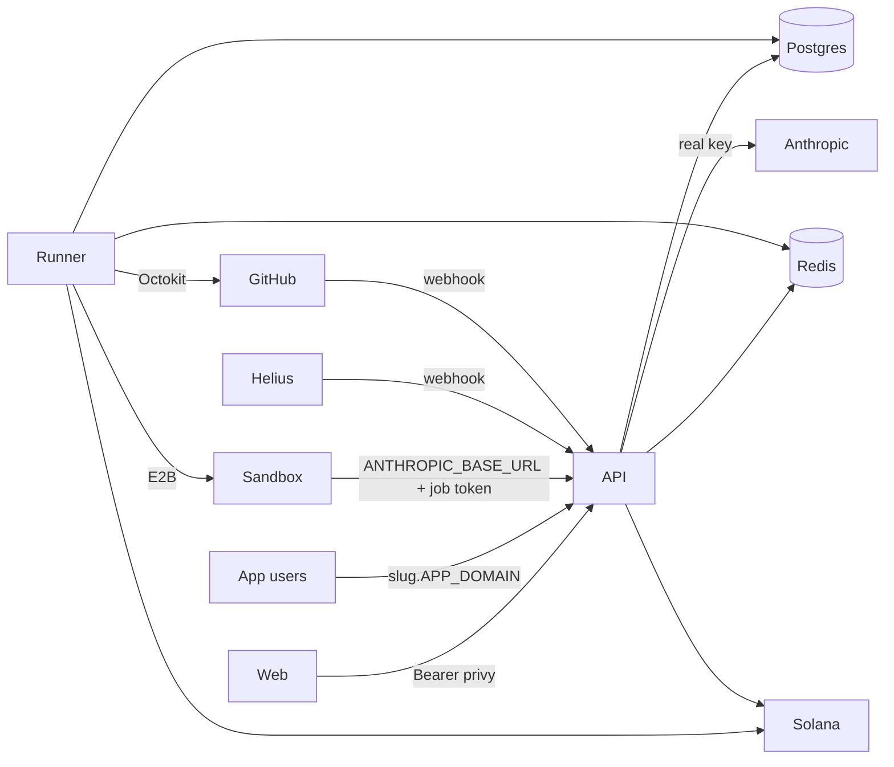
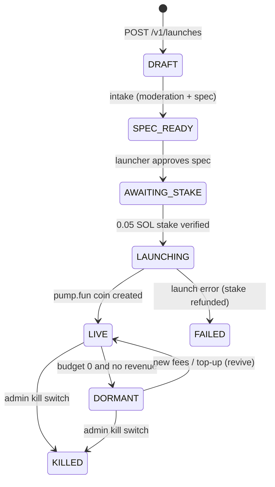
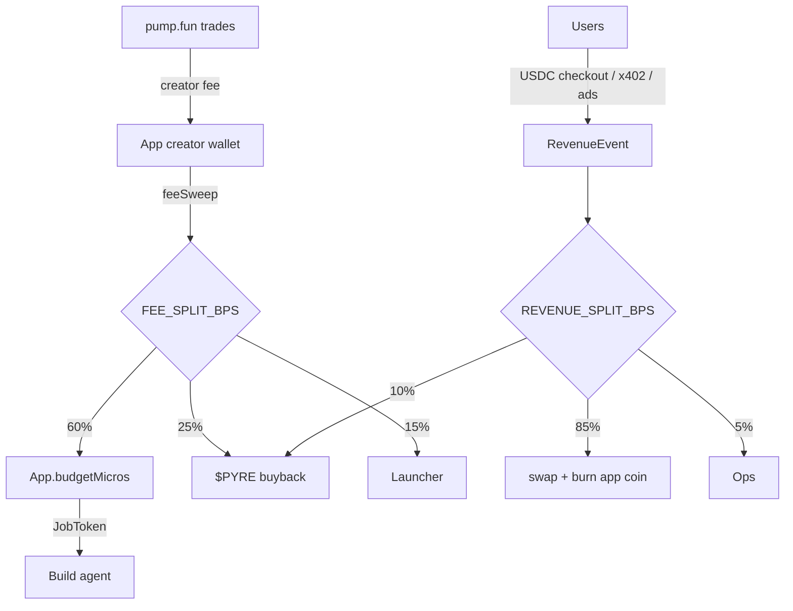

# Pyre architecture

Pyre is a pump.fun launchpad where every coin funds one app. Creator fees from the coin accrue into a build budget; an AI agent spends that budget building and shipping the app; app revenue buys back and burns the coin. Three deployable services, one Postgres, one Redis.

## Services

| Service | Package | Role |
| --- | --- | --- |
| `api` | `@pyre/api` | Public JSON API under `/v1`, app hosting (`<slug>.APP_DOMAIN` and `/a/<slug>`), `/_pyre/*` platform endpoints inside app origins, Anthropic proxy for sandboxes, webhooks (Helius, GitHub), SSE feeds. |
| `runner` | `@pyre/runner` | BullMQ workers: intake, launch, build (E2B sandbox + agent), PR review, fee sweep, buyback+burn, monitor/self-heal, price/holders refresh, scheduler, growth. Writes the DB directly; no HTTP to the API except the proxy used from inside sandboxes. |
| `web` | `@pyre/web` | Vite React SPA: leaderboard, launch flow, coin pages, dashboards, ops, legal pages. Talks only to the API with a Privy bearer token. |

Shared libraries: `@pyre/shared` (economics constants, zod schemas), `@pyre/db` (Prisma client + types), `@pyre/chain` (Solana: keypairs, pump.fun launch, fee collection, Jupiter swap, burn, Helius holders), `@pyre/app-sdk` (browser SDK bundled into every generated app).

## Queues (BullMQ on Redis)

| Queue | Producer | Consumer | Job |
| --- | --- | --- | --- |
| `intake` | API (`POST /v1/launches`) | runner | moderation classifier + spec generation → `SPEC_READY` |
| `launch` | API (`stake` confirmed) | runner | create pump.fun coin with the app's derived keypair → `LIVE` |
| `build` | scheduler / API | runner | `BuildJobData`: SCAFFOLD+MVP+DEPLOY+VERIFY, ITERATE, SELF_HEAL |
| `prReview` | API (GitHub webhook) | runner | review + merge community PR, pay bounty |
| `feeSweep` | scheduler | runner | `collectCreatorFees` per app → `FeeEvent` + split |
| `buyback` | scheduler | runner | swap pending revenue to the coin, burn, `Buyback` row |
| `monitor` | scheduler | runner | health check; 3 consecutive fails → SELF_HEAL |
| `price` / `holders` | scheduler | runner | DexScreener/pump price + Helius holder balances |
| `growth` | scheduler, build engine, `growth:daily` repeatable | runner | X posts, mention replies, ad tests |
| `scheduler` | repeatable | runner | ticks the loops above, detects revive/dormant transitions |

Feed: every notable event is a `BuildEvent` row and a Redis `PUBLISH` on `feed:<appId>`; the API relays it over SSE at `/v1/apps/:slug/feed/stream`. `feed:*global*` wakes leaderboard subscribers.

## App lifecycle

## Money flow

Every movement writes a `LedgerEntry` (`TREASURY`, `PYRE_TOKEN`, `OPS`, `LAUNCHER:<userId>`, `BUILD:<appId>`, `CONTRIB:<appId>`, `STAKERS:<appId>`). USD is stored as BigInt micros, SOL as lamports, tokens as base units.

## Build loop

1. Scheduler sees `budgetMicros >= MIN_BUILD_BUDGET_USD` (first build) or `>= ITERATION_BUDGET_USD.MIN` (iterations) and enqueues `build`.
2. Runner creates a `JobToken` (budget-capped, expiring), an E2B sandbox, and writes the template or clones `GITHUB_OWNER/pyre-<slug>`.
3. The in-sandbox runner script drives the Claude Agent SDK. The sandbox only ever sees `ANTHROPIC_BASE_URL={API_ORIGIN}/v1/proxy/anthropic` and the job token.
4. `npm run build`, `npm test` (Playwright), screenshots, then a reviewer model reads the diff and manifest. BLOCK on auth/wallet/payment code, external scripts, raw network calls, exfiltration, policy violations, or spec drift.
5. On APPROVE: commit + push, `Deployment` (tar of `dist/` + `functions/` + manifest, extracted into `DeployFile`), `App.liveVersion++`, `DEPLOY` event, sandbox killed, token revoked, budget debited by actual cost.

## Security perimeter

- **Template**: generated apps start from `template/` with lint rules that ban `fetch`, `XMLHttpRequest`, `WebSocket`, `<script src>`, `eval`, and secret storage. Auth, wallet, and payment code is never written by the agent; it comes from `@pyre/app-sdk`.
- **CSP** on every hosted app: `default-src 'self'; script-src 'self'; connect-src 'self' https://auth.privy.io wss://*.privy.io; img-src 'self' data: https:; style-src 'self' 'unsafe-inline'; frame-src https://auth.privy.io https://*.privy.io; form-action 'none'; base-uri 'none'`. Runtime config is injected as `/_pyre/env.js`, not inline.
- **Origin isolation**: each app is served from its own subdomain with its own HMAC-signed `pyre_app_session` cookie. Apps cannot read each other's KV or sessions.
- **QuickJS** for server functions: 64 MB memory, 5 s interrupt deadline, no network except `ship.fetch` to `https://*.APP_DOMAIN/_pyre/fn/*`, `ship.llm` limited to 1024 output tokens and charged to the app budget.
- **Anthropic proxy**: sandboxes never hold the real key. Job tokens are per-job, budget-capped, expire, and are revoked after the job; the proxy meters usage and returns 402 when exhausted. A global daily compute ceiling (`GLOBAL_DAILY_COMPUTE_CEILING_USD`) caps platform-wide spend.
- **Keys**: per-app Solana keypairs are derived from `PLATFORM_MASTER_SEED_HEX` (index 0 = treasury) and exist only in runner/API memory. X, GitHub, Helius, and Anthropic secrets live only in the runner/API environment.
- **Payments**: USDC checkouts and x402 calls are verified on-chain by signature + memo before any revenue is recorded. Nothing trusts a client-reported amount.
- **Moderation**: intake classifier, reviewer gate on every deploy, public reports (`POST /v1/reports`), admin kill switch (`POST /v1/admin/apps/:id/kill` → status `KILLED`, 410 page).

## Growth worker

Runs for apps with `growthEnabled` and budget ≥ $2. Sources: app spec + last 24 h of `DEPLOY`/`COMMIT`/`MILESTONE`/`PR_MERGED` events. Outputs: changelog thread (≤3 tweets), milestone card, revive post, deploy post, ≤5 mention replies/day (dedupe in Redis, 7 d), and a ≤$5 internal ad test for apps past $100 revenue. Every post is a `GROWTH_POST` feed event; when `X_API_*` is unset the post is recorded as `[X not connected]` with an empty URL. Cost = LLM usage + $0.05 per published post, debited from `budgetMicros` with a `BUILD:<appId>` ledger row.
