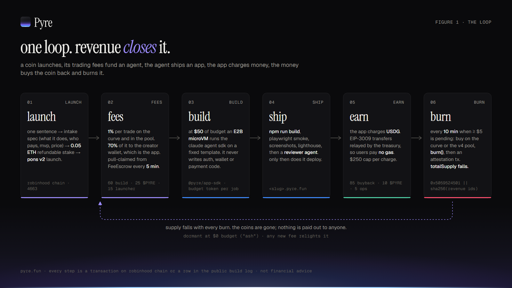
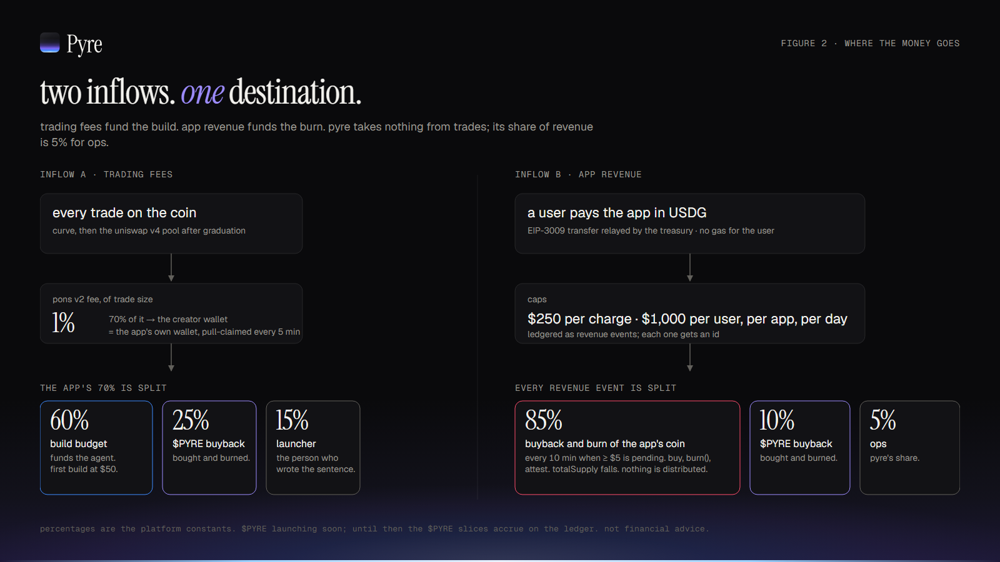
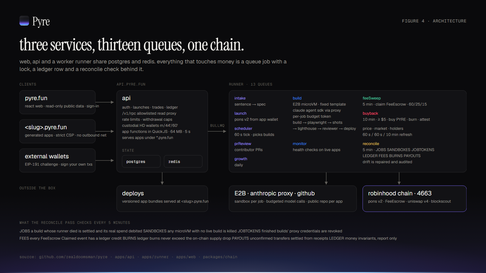
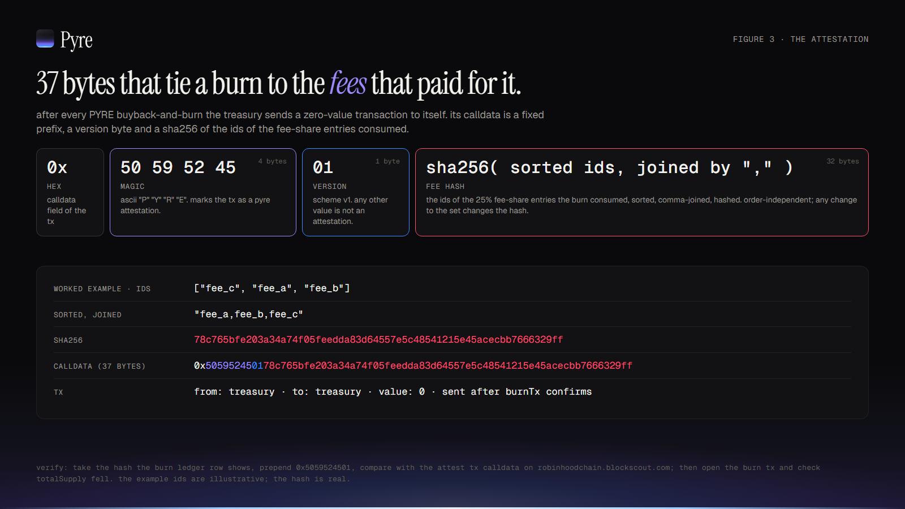
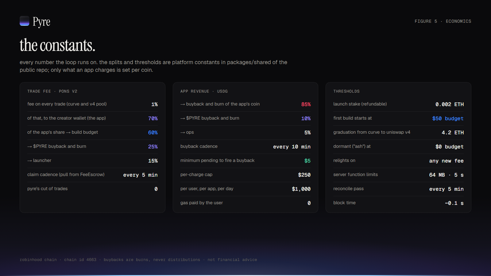
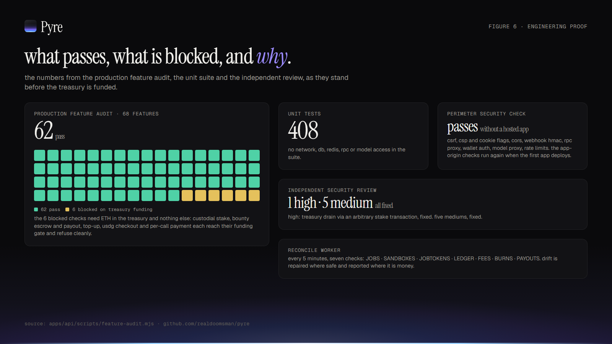
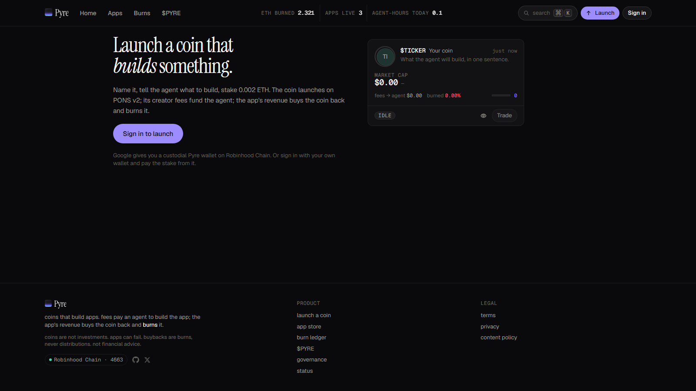

# coins that build apps. every fee burns PYRE.

*How Pyre turns a one-sentence idea into a launched coin, a funded AI build, a free app and a verifiable burn, on Robinhood Chain, with the numbers, the addresses and the parts that are not finished yet.*

---

Pyre is a launchpad with a job attached. Every coin on it is a pons v2 launch on Robinhood Chain, and every coin describes an app. The coin's trading fees pay an AI agent to build that app. The app is free to use; holding the coin unlocks features inside it. A quarter of every coin's fees buys PYRE, the platform coin, and burns it, and each burn is attested on chain in a way anyone can check.

The site is live at [pyre.fun](https://pyre.fun), the API at [api.pyre.fun](https://api.pyre.fun), and the code is public under MIT at [github.com/realdoomsman/pyre](https://github.com/realdoomsman/pyre). This is the long version: what it does, why it is built this way, and what is still blocked.

## the problem, in three parts

Launchpad coins have nothing behind them. A coin launches, a curve fills, a pool opens, and from then on the only thing the coin does is trade. There is no product, no reason to hold beyond the next trade, and the fees the venue collects go nowhere you can see.

App builders cannot fund themselves. A small useful tool, a crawler that emails you once a week, a scoring page for landing sites, is worth having but not worth a fundraise. There is no capital for the first fifty dollars of work, so the work does not happen.

Buybacks are usually theatre. "We buy back" means a wallet bought some coins. It rarely means the supply fell, it almost never says which money paid for it, and neither claim can be checked without trusting the team.

Pyre is an attempt to close all three at once with one loop, and to make each step of that loop a transaction you can open on an explorer.

## the loop



**Launch.** You write one sentence: what the app does. An intake agent turns it into a spec: what it does, who it is for, the MVP, and optionally a holder tier, a feature that opens for wallets holding at least some amount of the coin. You edit or approve it. You stake 0.05 ETH; the stake is spam control, refunded in full when the app first reaches its build threshold, or immediately if the launch fails. The coin is launched on pons v2 from the app's own derived wallet, so pons records that wallet as creator and fee recipient. There is no team allocation, no pre-mine and no launcher supply. Every coin is bought on the curve or in the pool like anyone else's.

**Fees.** pons v2 charges 1% on every trade, on the bonding curve and, after graduation, in the Uniswap v4 pool. 70% of that 1% goes to the creator wallet, which is the app. Pyre pull-claims it from the pons FeeEscrow every five minutes and splits it three ways: 60% to the build, 25% to a PYRE buyback, 15% to the person who launched the coin. That is the only money an app ever has.

**Build.** When the spendable build budget reaches $50, the scheduler starts the first build. An E2B microVM boots from a fixed template and runs the Claude Agent SDK against the spec. The agent can write product code. It cannot write auth or wallet code; those come from `@pyre/app-sdk` and are hard-blocked at review. There is no payment code for it to write, because apps do not take payments.

**Ship.** The output has to pass `npm run build`, a Playwright smoke test, screenshots, Lighthouse, and then a reviewer agent that reads the diff and the manifest and rejects anything that asks users for money, makes raw network calls or drifts from the spec. Only then does it deploy to `<slug>.pyre.fun`. Every tool call the agent makes is published to the coin page as it happens.

**App.** The app is free. No checkout, no subscription, no per-call price, no ads. If the spec named a holder tier, the app checks the signed-in wallet's coin balance on chain and opens that feature for holders. Nothing else about the coin reaches into the app.

**Burn.** Every ten minutes, if at least $5 of PYRE share has accrued across all coins, the treasury buys PYRE with it, on the curve before graduation or through Uniswap v4 after, and calls `burn()`. pons v2 coins are `ERC20Burnable`, so `totalSupply()` actually falls; Pyre reads the supply before and after and stores the difference. Then it sends the attestation transaction described below. App coins themselves are never bought back; their fees fund the build and the PYRE burn.

If the build budget hits $0, the app goes dormant. Pyre calls this "ash". The page is still served, and any new fee, from a single trade, relights it.

The front page ranks coins by what is moving through the loop: trade volume, the fees it produced, and what the agent has shipped, not by market cap. The app is the point; the coin is the consequence.

## where the money goes



One inflow. Trading fees fund the build and the burn. Pyre takes nothing from trades and nothing from apps; there is no platform cut anywhere in the loop.

A worked example from the repo's economics doc: $10,000 of trading volume sends $70 of ETH to the app wallet. $42 goes to the build cut (half as spendable budget, half funding the model credits that pay for the agent's compute), $17.50 to the PYRE buyback, $10.50 to the launcher. At that rate the first build starts after roughly $24,000 of volume. Each build job spends up to $25 by default and never more than $50, debited by the job's actual metered cost, not the cap. The PYRE burn fires as soon as the pooled 25% across every coin clears $5.

## why robinhood chain and pons v2

Robinhood Chain is an Arbitrum Nitro L2 (chain id 4663) with roughly 0.1-second blocks and ETH gas. The loop makes a lot of small transactions: a fee sweep and claim every five minutes per coin, a buyback every ten, a burn and an attestation for each. It needs a chain where that is cheap and fast.

pons v2 supplies three things Pyre needed and did not want to write. A bonding curve that graduates: the full supply is minted to a per-launch curve, and when it has raised 4.2 ETH the curve closes and liquidity moves into a Uniswap v4 pool whose position is held permanently by the pons launch locker (the pons docs describe it as locked, with no unlock path) and whose hook charges the same 1% on every swap. A pull-based FeeEscrow, so creator fees sit in a contract until claimed, and each claim is a public `Claimed` event Pyre reconciles against its own ledger. And coins that are `ERC20Burnable`, so a burn is a real supply reduction, not a transfer to a dead address. Pyre launches with `creatorTaxBps` at 0 and pons's own buyback flag off: the only buy-and-burn it runs is of PYRE, and it runs that itself so every burn is attributable and attested. Pyre is a user of pons and of Robinhood Chain, not a partner of either.

## what the agent builds, and what it cannot touch



Generated apps start from a fixed template whose lint rules ban `fetch`, `XMLHttpRequest`, `WebSocket`, `EventSource`, `localStorage`, `eval`, script injection and `dangerouslySetInnerHTML`. Sign-in, wallet access and the holder gate are imported from `@pyre/app-sdk`, never written by the model, and the SDK has no way to ask a user for money. Each app is served from its own subdomain under a strict CSP with no outbound network, its own HMAC-signed session cookie and origin checks on every mutating request, so apps cannot read each other's storage or sessions. Server-side logic runs in QuickJS: 64 MB of memory, a 5-second CPU deadline, no imports, no network except other Pyre functions.

The build sandbox never holds a real API key. It sees a per-job credential against an Anthropic proxy that allowlists models, meters usage, returns 402 when that job's budget is exhausted and 429 when the platform's daily ceiling is, and is revoked when the job ends. Behind all of it, a reconcile worker runs every five minutes across seven checks, JOBS, SANDBOXES, JOBTOKENS, LEDGER, FEES, BURNS and PAYOUTS: settling builds whose runner died, killing sandboxes with no live job, replaying missed fee claims into the ledger, and reporting, never auto-correcting, anything that touches money.

## the attestation



This is the part that makes "buyback" a checkable claim. After the burn transaction confirms, the treasury sends a zero-value transaction to itself. The calldata is 37 bytes:

```
0x 50595245 01 <32-byte sha256>
   ^^^^^^^^ ^^ ^^^^^^^^^^^^^^^^
   "PYRE"   v1 sha256(sorted ids of the fee entries consumed, joined by ",")
```

The hash is over the ids of the PYRE fee-share entries the buyback consumed, sorted and comma-joined, so it is order-independent, and any change to the set (an id added, removed or duplicated) changes it. Worked example: the ids `["fee_c", "fee_a", "fee_b"]` sort to `fee_a,fee_b,fee_c`, whose sha256 is `78c765bfe203a34a74f05feedda83d64557e5c48541215e45acecbb7666329ff`. The calldata on chain is therefore:

```
0x505952450178c765bfe203a34a74f05feedda83d64557e5c48541215e45acecbb7666329ff
```

The burn ledger publishes, for every burn, the hash, the ETH spent, the swap tx, the burn tx and the attestation tx. To verify one: take the hash from the ledger row, prepend `0x5059524501`, and compare with the calldata of the attestation tx on Blockscout. Then open the burn tx and confirm PYRE's `totalSupply` fell by the amount the row claims. No part of that requires trusting Pyre.

## the numbers



| item | value |
|---|---|
| trade fee (pons v2, curve and pool) | 1% |
| of that, to the creator wallet (the app) | 70% |
| app's share → build / PYRE buyback / launcher | 60% / 25% / 15% |
| fee claim cadence | every 5 min |
| PYRE burn cadence, minimum pooled | every 10 min, $5 |
| what an app charges its users | nothing |
| launch stake (refundable) | 0.05 ETH |
| first build starts at | $50 spendable budget |
| graduation from curve to Uniswap v4 | 4.2 ETH |
| supply per coin | 1,000,000,000, all on the curve |
| dormant at | $0 budget; relit by any new fee |
| server functions | QuickJS, 64 MB, 5 s |
| reconcile pass | every 5 min |

All of these are constants in `packages/shared` of the public repo. Only the holder tier, if any, is set per coin, in its spec.

## security posture, and what an independent review found

Browsers never hold a private key. Custodial users and apps are BIP-32 children of one platform seed on separate branches (`m/44'/60'`), derived in server memory only. External wallets sign in with an EIP-191 challenge with a single-use nonce. Every send from the treasury or an app wallet goes through one function that holds a Redis mutex from broadcast to receipt, and the treasury fails closed rather than drop below its floor.

Nothing trusts a client-reported amount. External stakes and top-ups are verified by receipt before anything is recorded, and a transaction hash can only ever settle one launch. The public `/v1/rpc` endpoint forwards an allowlist of read methods only, no batches, rate-limited per IP. Rate limits are Redis sliding windows per bucket; the auth, payout, proposal and proxy buckets fail closed if Redis is down.

An independent security review of the codebase found one High and five Medium issues. The High was a treasury-drain path: stake settlement accepted an arbitrary transaction hash as proof of stake, so any inbound treasury transaction, a fee sweep, an escrow claim, could be presented as a stake and refunded to the caller. It is fixed: a stake tx must be mined and successful, sent to the treasury, of at least the stake value, from the launcher's proven wallet and not from a platform wallet, and each hash can be used once. The five Mediums are fixed as well.

## engineering proof



The unit suite runs across the API, runner, web, chain and shared packages with no network, database, Redis, RPC or model access, so it runs in CI on every push.

The production feature audit exercises the deployed system end to end: real HTTP against the public origin, a throwaway wallet signing the SIWE-style challenge, the rate limiter, auth and routes running unmodified. Every feature passes except the ones that need ETH in the treasury: the custodial stake, bounty escrow and payout, and the build-budget top-up each reach their funding gate and refuse cleanly.

The perimeter security check covers CSRF on app endpoints, CSP and cookie flags, CORS, webhook HMAC, the RPC proxy, wallet auth, the model proxy and rate limits. Every check that can run without a hosted app passes; the app-origin checks run again the moment the first app deploys.

## what is live today, and what launches next

Everything above is deployed: the web app, the API, the runner with all thirteen queues, the E2B build template, custodial wallets, holder gating, the burn ledger and the reconcile pass, all against Robinhood Chain mainnet.

Two things are not yet true. The treasury at `0xdd9F2043c2df2Cd675ff4eF75373E82bB68389b6` is unfunded, which is why the on-chain audit checks are blocked and why no real coin has been through the loop yet. And PYRE has not launched. Until it does, the 25% PYRE slice accrues on the ledger and the PYRE page shows its pre-launch state. It is launching soon; there is no contract address until it exists, and anyone offering one is not us.

The site shows zeros today: no apps, no fees, no burns. The demo rows used to build and verify the platform have been removed, and no figure appears on pyre.fun until a real coin earns it.

What launches next, in order: treasury funding, an on-chain dry run of the full loop with a throwaway coin (launch, sweep, buy, burn, attest, with the hashes published), PYRE, then the first coins.

## launching from other chains: solana and pump.fun

Pyre started on one venue. The next update adds a second: a coin can launch on Solana through pump.fun instead of on pons v2, and the loop is the same loop. You write the sentence, the intake agent writes the spec, you stake, the coin launches from the app's own wallet, its creator fees pay the agent to build the app, and a quarter of every fee is bought back and burned with a receipt on chain. What changes is only what has to change because the chain is different.

**The stake** is in the venue's native asset: 0.05 ETH on Robinhood Chain, 1 SOL on Solana. Refundable at the first build either way.

**The wallet.** Every account gets a second custodial wallet, on Solana, derived on the server from the same seed as the first (`m/44'/501'`, the Solana convention) and never exposed to the browser. Deposit SOL to it, stake from it, trade from it, withdraw from it. Solana on Pyre is custodial only: there is no Solana wallet sign-in, and if you want to trade a Solana coin with your own key the coin page sends you to pump.fun to do it.

**The fee.** pump.fun pays the coin's creator, which is the app wallet, a creator fee: 30 bps of every bonding-curve trade, and a share of every PumpSwap trade after graduation that pump.fun tiers by market cap. Those are pump.fun's rates, not ours. pump.fun sets them, has changed them before, can change them again, and its terms say creator fees carry no warranty and can be re-routed under its community-takeover process. Pyre claims whatever accrued every five minutes and splits it the same 60/25/15.

**The burn.** Here is the one real difference. On Robinhood Chain the 25% buys PYRE. On Solana it cannot, because PYRE does not exist there, and Pyre will not bridge it. So a Solana coin's 25% buys that coin itself and burns it: the treasury's Solana wallet buys on the curve or on PumpSwap, calls the token program's burn so the mint's supply actually falls, and writes a memo transaction that reads `pyre:burn:v1:` followed by the same sha256 over the fee entries that the Robinhood attestation uses. Open the memo on Solscan, compare the hash with the coin page, check the supply. A Solana coin is bought back only with its own fee share, never with anyone else's, and never with a Robinhood coin's.

**PYRE is not moving.** It is one coin, on Robinhood Chain, and nowhere else. It is not bridged, wrapped, mirrored or relaunched on Solana. Any PYRE you find on another chain is not ours, nothing on Pyre will ever buy or burn it, and a coin styled as PYRE on Solana is impersonation under the content policy.

Launcher payouts stay where they are: the 15% is ledgered in dollars and paid in ETH on Robinhood Chain to the wallet on your account, whatever chain your coin is on. One payout path, one treasury that pays people.

The venue ships dark. It exists only when the platform is configured with a Solana RPC, production is not yet, and it goes through a staging run against Solana devnet — a real pump.fun launch, buy, fee claim, coin burn and memo, with the signatures published — before it is switched on for anyone. When it is, the launch page shows two cards: Robinhood Chain · pons v2, and Solana · pump.fun. Everything else on this page still holds for both.

## how to launch



1. Sign in at [pyre.fun/launch](https://pyre.fun/launch). Google sign-in gives you a custodial Pyre wallet on Robinhood Chain; or sign in with your own wallet.
2. Name the coin and write one sentence describing the app.
3. Read the spec the intake agent produces: what it does, who it is for, the MVP, and any holder tier. Edit it or approve it.
4. Stake 0.05 ETH, one click from a custodial balance, or send it to the treasury from your own wallet and submit the hash.
5. The coin launches on pons v2 from the app's own wallet. From then on the loop runs itself: fees are claimed, the build starts at $50, the app deploys when it passes review, and a quarter of every fee burns PYRE. You can read every tool call on the coin's build tab, queue tasks as a holder, and see every PYRE burn with its attestation on the burn ledger.

## verify it yourself

| what | where |
|---|---|
| Robinhood Chain | chain id 4663, RPC `https://rpc.mainnet.chain.robinhood.com` |
| explorer | [robinhoodchain.blockscout.com](https://robinhoodchain.blockscout.com) |
| pons v2 factory | [`0x7eD598BcEf8bd9Edd8C97A195C6d13f40801EC7e`](https://robinhoodchain.blockscout.com/address/0x7eD598BcEf8bd9Edd8C97A195C6d13f40801EC7e) |
| pons FeeEscrow | [`0xd3AFEB2a57f70eF218Aa82451c51B2fb0416Ac9e`](https://robinhoodchain.blockscout.com/address/0xd3AFEB2a57f70eF218Aa82451c51B2fb0416Ac9e) |
| PYRE | launching soon; no address until then |
| Pyre treasury | [`0xdd9F2043c2df2Cd675ff4eF75373E82bB68389b6`](https://robinhoodchain.blockscout.com/address/0xdd9F2043c2df2Cd675ff4eF75373E82bB68389b6) (currently unfunded) |
| burn ledger | [pyre.fun/burns](https://pyre.fun/burns), `GET https://api.pyre.fun/v1/burns` |
| platform totals | `GET https://api.pyre.fun/v1/stats` |
| attestation encoding | `packages/chain/src/burn.ts` in the repo; `ATTESTATION_PREFIX = 0x5059524501` |
| source | [github.com/realdoomsman/pyre](https://github.com/realdoomsman/pyre), MIT |

Every burn attestation is a treasury self-transaction whose calldata starts `0x5059524501`. Once the treasury is funded and PYRE is live, that prefix on Blockscout lists every burn Pyre has ever made.

## faq

**Does Pyre pay anything to holders?** No. Buybacks are burns. Nothing is distributed or shared. Supply falls; that is the whole mechanism.

**Does holding a coin get me anything?** Whatever the app chooses to unlock for holders, and a capped vote in its build queue. Apps are free for everyone; holding is a key, not a purchase.

**Who owns the app?** Each app has a public GitHub repo. Contributors can open pull requests, which go through the same reviewer gate, and bounties for merged work are escrowed in the treasury in ETH.

**What if the agent builds something bad?** It cannot deploy without passing build, smoke tests and a reviewer that blocks anything asking users for money, external scripts, raw network calls and spec drift. Apps run under a CSP with no outbound network, and server functions can only reach other Pyre functions. There is a public report endpoint and an admin kill switch that replaces the app with a 410.

**What if nobody trades the coin?** Then there are no fees, no build and no burn. When the build budget reaches $0 the app goes dormant. Any new trade fee relights it. Coins whose apps never get built will show that on the front page, because the front page ranks by what moved through the loop.

**Is this financial advice?** No. Coins are not investments. Apps can fail. Market cap is a fact the site displays, never a claim it makes.

## risks, plainly

The treasury is unfunded and no coin has completed the loop on mainnet. Everything on-chain in this article has been exercised in tests and against the deployed API, not yet with real ETH. The blocked audit checks are exactly that gap.

Coins can fail to earn fees. Most small coins do. A coin with no trades funds no build and no burn and goes dormant; the mechanism does not create demand, it only routes it.

The agent can produce mediocre software. The reviewer gate stops it shipping dangerous or off-spec code; it does not make the code good. Budgets are small by design.

Pyre depends on third parties it does not control: pons v2 contracts, Robinhood Chain, Uniswap v4, and once the second venue is on, pump.fun, PumpSwap and Solana; plus E2B and Anthropic. A change or outage at any of them stops the loop until it is handled. pump.fun's creator fee in particular is pump.fun's to set, change or re-route.

Custodial wallets are custodial, derived from one platform seed. If you would rather hold your own key, sign in with an external wallet and stake from it on Robinhood Chain; on Solana there is no such option, and you trade with your own key on pump.fun instead.

Every number on pyre.fun is zero until a real coin earns it. Nothing there is seeded, sampled or projected.

Not financial advice.

---

*Pyre · [pyre.fun](https://pyre.fun) · [@PyreFun](https://x.com/PyreFun) · [github.com/realdoomsman/pyre](https://github.com/realdoomsman/pyre) · Robinhood Chain 4663*
